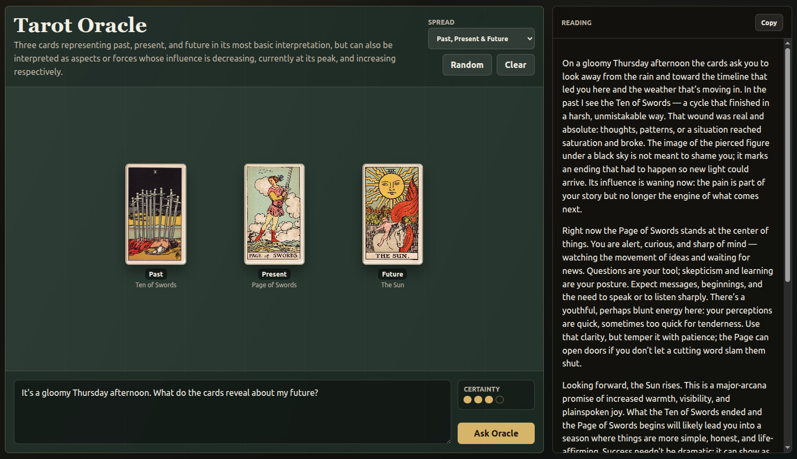

# Tarot Oracle

**Authors:** Sascha Mücke & OpenAI Codex (GPT-5.5), 2026



Tarot Oracle is a small FastAPI web app for performing card readings with an LLM. It shows a top-down spread of cards, lets the user choose cards manually or generate a random spread, accepts a free-form question or situation prompt, and streams back a spoken-style oracle reading with a visual certainty rating.

The default deck is the Rider-Waite Tarot, but the app is designed around human-editable TOML data. Decks live in `data/decks/`, spreads live in `data/spreads/`, and the card images can be downloaded separately so they do not need to be committed to the repository.

## Project Layout

- `src/` - FastAPI backend and browser frontend.
- `src/static/` - HTML, CSS, and JavaScript for the app.
- `data/decks/tarot.toml` - default deck metadata, cards, tags, visual descriptions, and interpretations.
- `data/spreads/*.toml` - spread definitions loaded into the UI dropdown.
- `img/` - card images, plus a helper script to download them.
- `logs/` - optional timestamped LLM call logs when `PROMPT_LOGGING=true`.

## Setup

Create and activate a virtual environment:

```bash
python3 -m venv .venv
source .venv/bin/activate
```

Install dependencies:

```bash
python -m pip install -r requirements.txt
```

Download the card images:

```bash
./img/download-images.sh
```

Create your local environment file:

```bash
cp .env.example .env
```

Then edit `.env` and set at least:

```bash
OPENAI_BASE_URL="https://api.openai.com/v1"
OPENAI_API_KEY="your-api-key"
LLM_MODEL="gpt-5-mini"
WEB_SEARCH_ENABLED=false
APP_LOCALE=
DECK_PATH="./data/decks/tarot.toml"
PROMPT_LOGGING=true
```

`WEB_SEARCH_ENABLED=true` gives the LLM agent Pydantic AI's native web search capability when the selected model/provider supports it.

`APP_LOCALE` is optional. Browser readings send their own locale and time zone automatically; this value is only used as a fallback for non-browser API calls.

`PROMPT_LOGGING=true` writes one timestamped log file per LLM call in `logs/`. Each log includes the prompt, response, usage, and raw message/tool trace when available.

## Launch

Start the development server:

```bash
./launch.sh
```

Then open:

```text
http://127.0.0.1:8000
```

The server runs with Uvicorn reload mode. Stop it with `Ctrl+C` in the terminal where it is running.

## Data Files

To add a spread, create a new TOML file in `data/spreads/`. Every `*.toml` file in that folder appears in the spread dropdown.

To use another deck, create a TOML deck file in `data/decks/` and set `DECK_PATH` in `.env` to that file. Card image paths are resolved relative to the deck's `image_base` unless they are absolute URLs or absolute paths.

## Dependency Pinning

`requirements.txt` pins the direct project dependencies to the versions used during development. Transitive dependencies are left for `pip` to resolve from those pinned direct packages.
